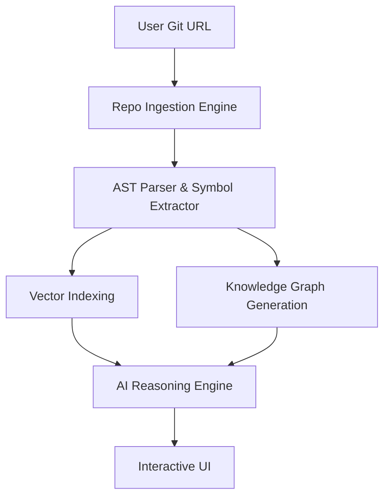

# DevMentor AI 

> **Stop reading code. Start understanding systems.**

DevMentor AI is an intelligent repository analysis platform that acts as a senior engineer sitting right next to you. It transforms complex codebases into interactive knowledge graphs and provides layered explanations to accelerate onboarding and debugging.

##  Key Features

* **Repository Ingestion:** Seamlessly clone and parse Git repositories (Python, JS/TS, C/C++).
* **Architecture Explorer:** Visualizes module dependencies and system flow using a dynamic **Knowledge Graph**.
* **Multi-Level Explainer:** Get code breakdowns tailored to your skill level (**Beginner, Intermediate, or Advanced**).
* **Debugging Mentor:** Instead of just fixing bugs, it provides **guided reasoning** and hypotheses to help you learn.
* **Semantic Code Search:** Ask questions in natural language like *"How does the auth flow reach the DB?"*
* **Documentation Bot:** Automatically detects and generates missing READMEs and docstrings.

##  Tech Stack

* **Frontend:** React / Next.js, Tailwind CSS, `react-flow` (Visualization)
* **Backend:** FastAPI (Python), `tree-sitter` (AST Parsing)
* **AI/LLM:** OpenAI GPT-4o / Claude 3.5, LangChain / LangGraph
* **Storage:** * **Vector DB:** Pinecone / ChromaDB (for Semantic Search)
* **Graph DB:** Neo4j / NetworkX (for Code Relationships)


* **Cloud:** AWS (Lambda, ECS, S3)

##  System Architecture



##  Getting Started

### Prerequisites

* Python 3.10+
* Node.js 18+
* OpenAI API Key

### Installation

1. **Clone the repo:**
```bash
git clone https://github.com/yourusername/devmentor-ai.git
cd devmentor-ai

```


2. **Setup Backend:**
```bash
cd backend
pip install -r requirements.txt
python main.py

```


3. **Setup Frontend:**
```bash
cd frontend
npm install
npm run dev

```


##  The "Mentor" Philosophy

Unlike standard AI coding assistants that simply "write code for you," DevMentor AI focuses on **comprehension**. It prioritizes:

1. **Context over Snippets:** Understanding the *impact* of a change across the graph.
2. **Reasoning over Fixes:** Guiding the developer through the "Why" to improve long-term skill.

---
